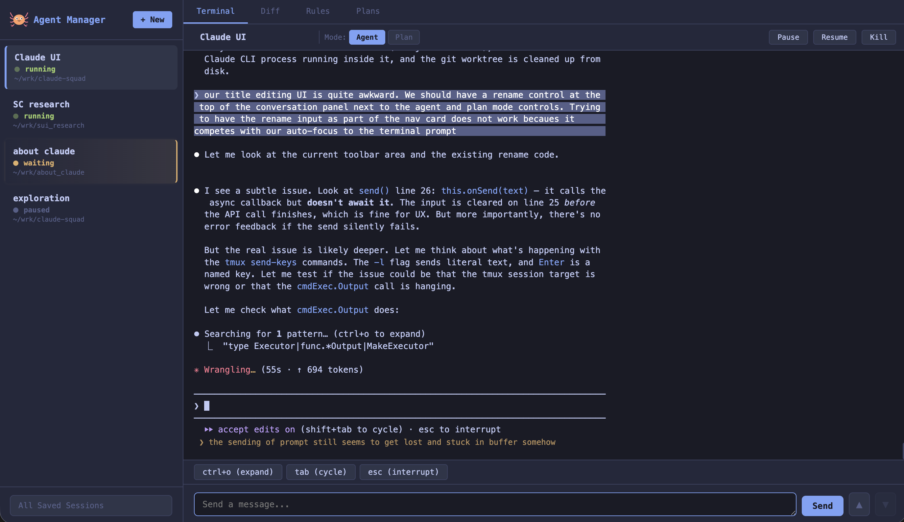

# Agent Manager Web UI

A browser-based interface for managing multiple Claude Code sessions, built on top of [claude-squad](README.claude-squad.md).



## What's New

This fork extends claude-squad with a full web UI that adds:

- **Multi-session management** — Create, pause, resume, and kill Claude conversations from the browser
- **Live terminal output** — Real-time streaming of conversation output via WebSocket
- **Interactive controls** — Send prompts, respond to tool-use confirmations, switch between Agent and Plan modes
- **Diff viewer** — See git changes for each conversation in a dedicated tab
- **Rules editor** — Edit CLAUDE.md and settings files directly from the UI
- **Plans tab** — View and edit plan files colocated with each conversation
- **Renameable sessions** — Give conversations display names without disrupting internal state
- **Drag-to-reorder** — Organize your sidebar by dragging conversations
- **Git worktree isolation** — Optionally run each conversation in its own git worktree

## Quick Start

```bash
go build -o agent-manager .
./agent-manager serve --port 8080
```

Then open `http://localhost:8080` in your browser.

## Architecture

See [webserver/ARCHITECTURE.md](webserver/ARCHITECTURE.md) for details on the data flow, API endpoints, and design decisions.
